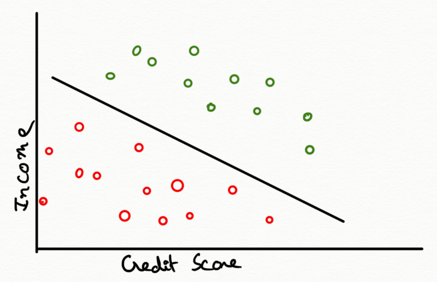
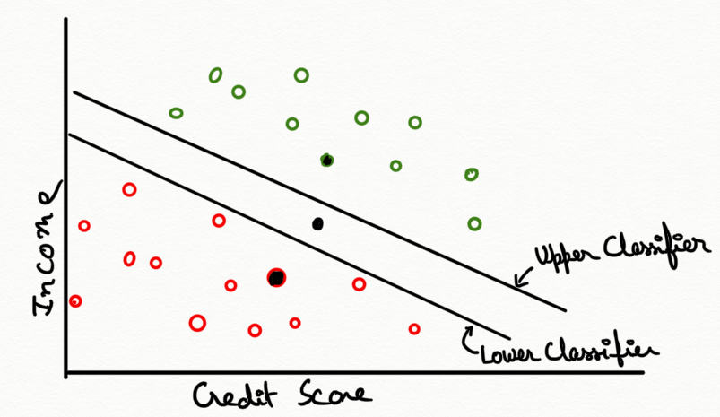
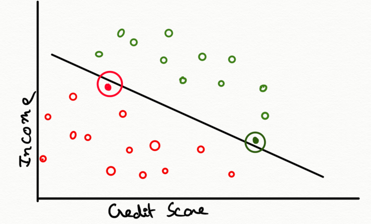
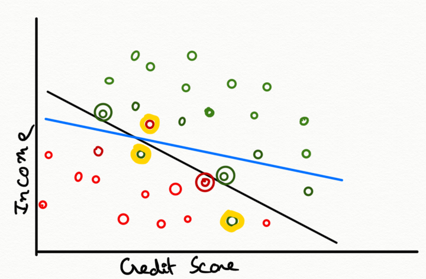
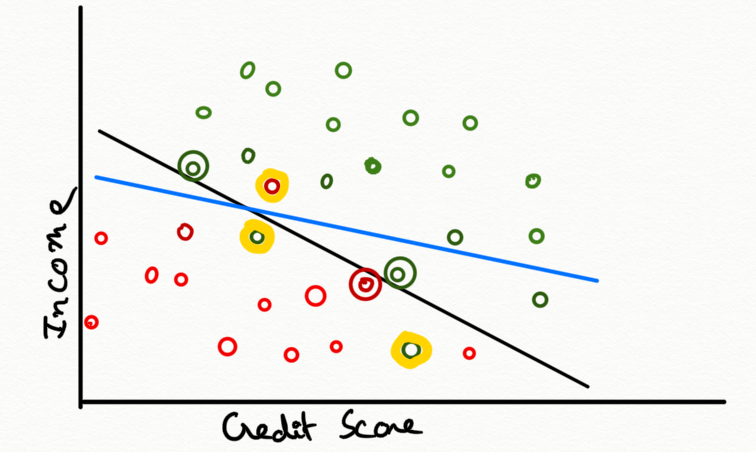
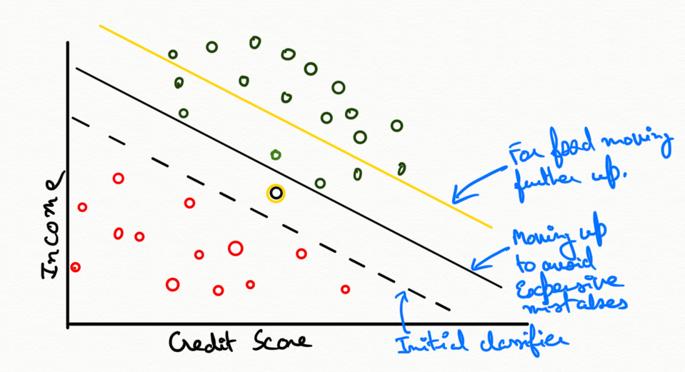

 # Classification
 > we'll learn about classification,
including what it means, examples of when it's important and a simple demonstration of how classification works.

Classification in analytics has the same meaning as it does in everyday life, **putting things into categories.**
The simplest examples of classification
are when there are two categories,
which are often just yes and no.

For example,
- a bank might want to differentiate  between loan applications who will fully repay their loan and those who won't.
- A security agency might want to differentiate between a regular person and a potential terrorist.
- An automated email filter might need to differentiate between real and spam email.
- A legal document system might be designed to differentiate between documents that are relevant or irrelevant to a certain case.
- In professor research, he is working with a CDC on a project to increase the number of organs that can be given to people in need of a transplant and one of the questions he use analytics to answer is this organ safe to transplant
or does it carry a deadly infectious disease. Of course, one answer would be to subject the organ to a laboratory test, but if the donor was recently infected, the test might not come out positive yet, so we need the analytical approach.

In each case, we can use classification models to put applicants, people, documents, livers, et cetera into one of the categories and as you can imagine, having more than two categories as well is possible.
For example,
- a political consultant might want to differentiate between supportive voters, opposition voters, and undecided voters.
- a paleontologist might want to differentiate between many different species of dinosaurs to determine which one a newfound bone belongs to.

Each of these classification questions
will require some data in order to get answers. For example,
- for loan applicants, a bank might collect data on income, credit history, age, family size, assets, liabilities, and more.

Based on those attributes of previous loan recipients and the bank's observation of whether each loan
was repaid or not, the bank can then build a model to help classify future applicants.

Above image shows graph for bank that is trying to decide whether or not to give loans to applicants based on the applicants' credit scores and incomes.
Plotted all the information on a graph
where the horizontal axis shows credit score, the vertical axis shows household income, and each previous applicant is either a green data point if they repaid their entire loan or a red data point if they defaulted.
A line that separates
between the green points above and the red points below. This line shows how we could use the line to determine whether to give a loan to a new applicant or not. Then we wondered whether it was the right line to draw
because there are so many other ones we might also draw.

**Here's the problem.**
Consider just these two lines,
called separators or classifiers.
For lots of applicants, like the two black points, both classifiers make the same decisions. But how about applicant in the lines? The lower classifier would suggest that we give this applicant a loan while the higher classifier would suggest that we deny the loan application.

**Which one should we use?**
That's a great question.
In general, we'd like to choose the line
that's farther from making mistakes.

This means, suppose we use this line to separate. It gets pretty close to a red point and pretty close to a green point, which means it almost makes a couple of mistakes in classification. If the line or the points were a little different,
the line might misclassify them.
That's important because the input data might not be exact. What if person represented by red got a small raise, and their income was a bit higher than the record showed? It will go up the classifier line. We don't want small uncertainties in the data to cause classification errors.

So instead, suppose we use this new line. It's much farther away from any of the points, so it's not so close to making mistakes. It would take a much bigger error in the data to cause a misclassification. That's more like what we're looking for, and we'll see how to formalize this in another lesson,
but first, let's see another situation.

**What if it's just impossible to avoid
making classification mistakes?**
Here's a slightly different graph
of good and bad credit risks.
As you can see, there's no line that can perfectly separate between the green and red points. So we need what's called a **soft classifier**,
one that gives as good a separation as possible
rather than a hard classifier that separates perfectly.

Here's a classifier indicated by black line that minimizes the number
of incorrectly classified points.
There are two green points on the red side,
and one red point on the green side,
but it's close to making a lot of other mistakes, indicated by green and red circles.
If we tilt and slide the line  indicated by blue a little bit,
we get a few more mistakes,
but we have fewer total mistakes plus near mistakes.
And we can envision trading off these two things,
actual mistakes and near mistakes,
depending on how important we think each one is.
Speaking of how important something is,
we've been talking about minimizing errors
as if both kinds of mistakes are equally bad.

But **what if the cost of giving
a loan that won't be repaid is much higher than the cost of mistakenly turning away a good applicant?**
Or, if instead of classifying loan applicants,
we're classifying plants into edible and poisonous?
The cost of mistakenly eating a poisonous plant is
obviously much worse than mistakenly not eating
an edible one.
How might we change the definition
of the best separator then?
Here's how we can do it.
The more costly one type of bad decision is,
the more we want to move the line away from it.
So let's say we've determined that the cost of making
a bad loan is twice as high as the cost of turning away
a good loan.
Then we can shift the line so it's closer
to the green points than it is to the red points.
Now, if we have a new applicant black point in graph
whose status is ambiguous because it's between
the green and red points,
even though it's closer to the green points,
our new cost-conscious classifier will still suggest
that we deny this loan application.

Or if we're deciding whether it's a plant we can eat,
our classifier will tell us not to take the risk.
In fact, we might be thinking
that if it's a question of whether or not
a plant we eat is poisonous,
even this new classifier might not be conservative enough.
With our life at stake, even if the graph looks like we can perfectly classify data points,
we still might not want to be so risky.
We might even be willing to misclassify
some green points in order to push our classifier even farther from any red points.
This sort of thing is also important in medical analytics.
For example, the cost of missing a case of HIV is very high.
The person might go out and unknowingly infect
other people, so tests are often set with a high classifier.
Then if someone tests positive,
they can take a second test to verify
whether they really do or do not have HIV.
So that's the idea of how we can consider
the different costs of **classification errors**.
We can use the same approach
for soft classification, too,
given that it's impossible to separate
with no mistakes, **we might be more willing
to accept one type of mistake than another.**

Finally, let's see one more type of insight
we can get from this sort of picture.
Suppose we thought we needed two attributes
to classify applicants, and the data looks like this.
Notice how the classifier is almost parallel
to the vertical axis.
**All that really seems to matter for classification is
the horizontal axis attribute,
so we've discovered that only one attribute is needed
for classification, not two.**
