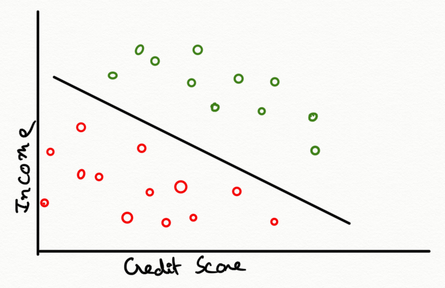
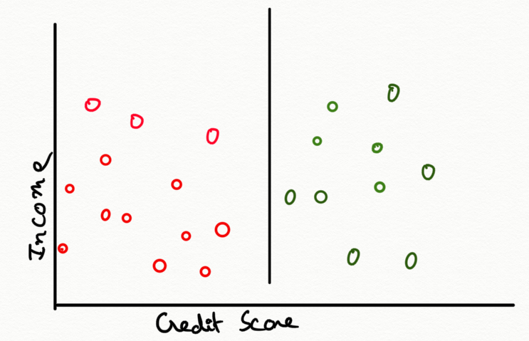

# Support Vector Machines (SVM)

Classification in Analytics has the same meaning as it does in everyday life: putting things into categories.

Below we show graphical example about a bank that is trying to decide whether or not to give loans to applicants based on the applicants credit scores and incomes.Plot shows all the information on our graph, where the horizontal axis shows the credit score, the vertical axis shows the household income, and each previous applicant is either a green data point if they repaid their entire loan, or a red data point if they defaulted.

Many lines can be drawn that separate between the green points above and the red points below. Few drawn lines might be better than others if they're farther from making mistakes, and also how some might be better than others if they're more likely to avoid types of mistakes that are more costly. For example, giving a loan to someone who won't repay it.

## Math for drawing classification lines

This model is known as Support Vector Machine, data set with n data points, and for each data point m attributes.

- $n = number\; of\; data\; points$
- $m = number\; of\; attributes$
- $x_{ij} = i^{th}\; attribute\; of\; j^{th}\; data\; point$
  - $x_{1j} = credit\; score\; of\; person\; j$
  - $x_{2j} = income\; of\; person\; j$
- $y_{j} = response\; for\; data\; point\; j$

- $y_{j} = \left\{ \begin{array}{ll}
            1\; if\; data\; point\; j\; is\; green\; person\; repaid\; the\; full\; loan\\
           -1\; if\; data\; point\; j\; is\; red\; person\ did\; not\; repay\; the\; full\; loan
          \end{array} \right.$

Line in above picture is defined by a set of coefficents $a_1$ through $a_m$ for each attribute, and an intercept $a_0$. Equation of line is
$$a_1.x_1 + a_2.x_2 + ...... + a_m.x_m + a_0 = 0 $$
$$\sum_{i=1}^{m}a_i.x_i + a_0 = 0$$

And parallel lines are just two lines with the same $a_1$ through $a_m$, and different intercepts $a_0$. Two parallel lines can be drawn that separate the red and green points such that $a_0$ is the intercept of the line right in the middle,and that line will be classifier.

Find values of $a_0$, $a_1$, up to $a_m$ that classify the points correctly and have the maximum gap or margin between the parallel lines. To classify correctly it means that all the green points need to be on one side of the line, and all the red points need to be on the other side of the line.

For all green points j: $$a_1.x_{1j} + a_2.x_{2j} + ... + a_m.x_{mj} + a_0 \geq 1$$
**1 is used for scaling it can be any number**

For all red points j: $$a_1.x_{1j} + a_2.x_{2j} + ... + a_m.x_{mj} + a_0 \leq -1$$
$y_j$ is defined to be 1 for the green points and -1 for the red points. Combining two expressions give eqaution for all points.$$(a_1.x_{1j} + a_2.x_{2j} + ... + a_m.x_{mj} + a_0)y_j \geq -1$$

Distance between two parallel lines $a_1.1_j + a_2.2_j + a_0 \geq-1$ and $a_1.1_j + a_2.2_j + a_0 \leq-1$ is :
$$\frac{2}{\sqrt{\sum_{i=1}^{m}(a_{i})^2}}$$

Minimize $\sum_{i=1}^{m}(a_{i})^2$ for $a_0,\, a_1,\,....,\, a_m$ will maximize the margin. Note here that sum is $a_1$ through $a_m$, $a_0$ the intercept is not part of the sum.This hard separation problem can be written as Minimize over all the a's, the sum of the squares of the a's which is the same as maximizing the margin as seen above. Subject to $$(a_1.x_{1j} + a_2.x_{2j} + ... + a_m.x_{mj} + a_0)y_j \geq 1$$, this sum on the left has to be greater than or equal to 1 for all data points. In other words, find values of $a_0$ through $a_m$ so that the margin, the distance between the lines, is the greatest. But these values should be choosen from values of the coefficients that correctly separate all the points.

But what if it's not possible to perfectly separate the red points from the green points? To handle this soft classifier is created. To do that all the errors in Classification are accounted, and trade off is made to minimize the errors and maximize the margin. For each data point j error is calculated in it's classification.If it's on the correct side of the line, then this sum is greater than or equal to 1, $$(\sum_{i=1}^{m}a_i.x_{ij} + a_0)y_j \geq 1$$ or rearrange so that the sum minus 1 is greater than or equal to zero $$(\sum_{i=1}^{m}a_i.x_{ij} + a_0)y_j  - 1 \geq 0$$

If it's on the wrong side, then the sum minus 1 is less than zero and the amount that it's than zero is the amount of error. $$(\sum_{i=1}^{m}a_i.x_{ij} + a_0)y_j  - 1 < 0$$
The farther the wrongly classified point is from the line the bigger mistake have been made. In general the error for data point j will be whichever is larger, 0 or the amount that point j is on the wrong side of the line. So the total error that is to be minimized can be written this way.$$max\{0,1 - (\sum_{i=1}^{m}a_i.x_{ij} + a_0)y_j\}$$

Minimize for all $a_0,\ ....,\, a_m$$$\sum_{j=1}^{n}max\{0,1 - (\sum_{i=1}^{m}a_i.x_{ij} + a_0)y_j\} + \lambda\sum_{i=1}^{m}(a_i)^2$$
To trade off between margin and error, a value of lambda is used to minimize a combination of error and margin. As lambda gets large,  $\sum_{i=1}^{m}(a_i)^2$ gets large. So the importance of a large margin outweighs avoiding mistakes and classifying known data points. And as lambda drops towards zero, $\sum_{i=1}^{m}(a_i)^2$ also drops towards zero, so the importance of minimizing mistakes and classifying known data points outweighs having a large margin. This approach to Classification is called the Support Vector Machine, or SVM model.

In the Basic Support Vector Machine Model for Classification remember that we're looking for these two parallel lines that are as far apart as possible while still having all the points of each color on one side of the lines. As seen in above figure, those two points are support vectors. And because the model takes the data set and automatically determines where those two lines should be, and what the support vectors are, it's called the Support Vector Machine Model. And that's where the name comes from. One more observation about the Support Vector Machine Model. Remember that the classifier is actually between the two parallel lines. And therefore it's in-between the support vectors, not touching either of them. So the odd thing about naming this the Support Vector Machine Approach, is that the classifier returns is actually not one of the lines touching a support vector.

How to account for some classification errors being more costly than others, how to prepare your data before running SVM, and whether we can use other types of classifiers.

First, let's look at hard separation, where we get a perfect classification of known data.The classifier we choose can depend on the value of the intercept. Generically, it's 'a' zero, but it can range from 'a' zero minus one to 'a' zero plus one, without making any mistakes on the known data. So we can adjust it as we want. For example, if giving a bad loan is twice as costly as withholding a good loan, we might choose an intercept of two thirds times 'a' zero minus one, plus one third times 'a' zero plus one.
$$a_1.x_1 + a_2.x_2 + ... + a_m.x_m + [\frac{2}{3}(a_0 - 1) + \frac{1}{3}(a_0 + 1)] = 0$$
$$a_1.x_1 + a_2.x_2 + ... + a_m.x_m + [a_0 - \frac{1}{3}] = 0$$

In a soft classification context, we might just add an extra multiplier $m_j$ for each type of error with a larger penalty, the less we want to accept mis-classifying that type of point.

Minimize for all $a_0,\ ....,\, a_m$$$\sum_{j=1}^{n}m_j*max\{0,1 - (\sum_{i=1}^{m}a_i.x_{ij} + a_0)y_j\} + \lambda\sum_{i=1}^{m}(a_i)^2$$
$m_j > 1\; for\; more\ costly\; errors$
$m_j < 1\; for\; less\ costly\; errors$

Let's take a closer look now at the part of what we're minimizing that helps maximize the margin. We're looking to minimize the sum of the squares of the coefficient.Minimize for all $a_0,\ ....,\, a_m$$$\sum_{i=1}^{m}(a_i)^2$$
But if our data has very different scales, we could run into a problem. For example, consider our two dimensions of credit score and household income. Credit scores range from about 300 to about 850 with some newer ones going from 150 to 950. In any case, a range of less than 1,000 between the top and bottom. Household incomes measured in dollars could have a range in the millions. That means the two coefficient values, 'a' one and 'a' two, might be different by two or three orders of magnitude. So, when we're looking and adding their squares, a small change in one could swamp a huge change in the other. But the fix isn't too hard. Before we run SVM, we can scale the data so that the orders of magnitude are approximately the same.Once the data is scaled, we can also use the values of the coefficients $a_1$ through $a_m$ to pick out attributes that aren't needed for classification.

In image below, we observe that the classifier is almost parallel to the vertical axis, which implies that the value of the vertical attribute is almost irrelevant for classification.

That's a nice observation if we can draw a two dimensional graph, but what happens if our data contains a lot of attributes and we can't just draw a nice picture to see what's going on. In that case, we can check the values of the coefficients, $a_1$ through $a_m$. If there's a coefficient who's value is very close to zero, it means that the corresponding attribute is probably not relevant for classification. For example, in this two dimensional picture, if the vertical axis shows a loan applicant's income, and the coefficient 'a' for income is close to zero, as it is in the picture, then we can eliminate income as an attribute and classify only using the attribute on the horizontal axis.

At this point you might be wondering a few things about SVM and classification.

- First, you might be wondering whether SVM works the same way in more than two dimensions, since most data sets of more than two attributes. The answer is pretty much, yes.

- Second, you might be wondering whether a classifier has to be a straight line. The answer is no. In fact, SVM can be generalized using kernel methods that allow for nonlinear classifiers.

- Third, you might step back and wonder whether some classification questions might also be answered as probabilities. For example, instead of directly saying, "Yes we should give this person a loan." Or, "No, we shouldn't." We could first determine something like, there's a 37% chance that this loan applicant will default, and make our lending decision based on that probability. For some applications, this approach could be more appropriate and the lesson on logistic regression models covers in method for estimating those probabilities.  

## Additional Resources

[SVM Tutorial](https://www.analyticsvidhya.com/blog/2014/10/support-vector-machine-simplified/?utm_source=blog&utm_medium=understandingsupportvectormachinearticle)

## Hyperparameters of the Support Vector Machine (SVM) Algorithm

- **Kernel:** A kernel helps us find a hyperplane in the higher dimensional space without increasing the computational cost. Usually, the computational cost will increase if the dimension of the data increases. This increase in dimension is required when we are unable to find a separating hyperplane in a given dimension and are required to move in a higher dimension:

